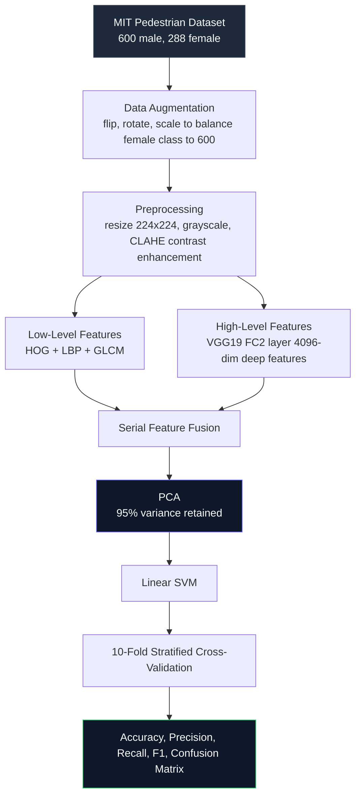

# Pedestrian Gender Classification


Binary image classification project for pedestrian gender detection. Combines hand-crafted low-level features (HOG, LBP, GLCM) with deep features extracted from VGG19's FC2 layer, fuses them, reduces dimensionality with PCA, and classifies using a Linear SVM evaluated across 10-fold cross-validation.

Dataset: MIT Pedestrian dataset with 600 male and 600 female images (female class augmented from 288 to balance the dataset).

---

## ⚡ How it works



---

## 🛠️ Stack

| Layer | Technology |
|---|---|
| Image Processing | OpenCV, CLAHE |
| Low-Level Features | HOG, LBP, GLCM (skimage) |
| Deep Features | VGG19 FC2 layer (TensorFlow/Keras) |
| Dimensionality Reduction | PCA, 95% variance threshold |
| Classification | Linear SVM (scikit-learn) |
| Evaluation | 10-fold Stratified K-Fold |
| Visualization | Matplotlib, Seaborn |

---

## 📊 Results

| Metric | Score |
|---|---|
| Accuracy | evaluated via 10-fold CV |
| Precision | evaluated via 10-fold CV |
| Recall | evaluated via 10-fold CV |
| F1 Score | evaluated via 10-fold CV |

Confusion matrix:


---

## 📁 Project structure

```
digital-image-processing/
├── Pedestrian Gender Classification.ipynb   # full pipeline
├── MIT-IB.rar                               # dataset
├── output.png                               # confusion matrix
└── README.md
```

---

## 🚀 Running locally

```bash
pip install opencv-python scikit-learn scikit-image tensorflow numpy pandas matplotlib seaborn
```

Open the notebook and update the folder path in section 1.1 to point to your local MIT-IB dataset directory. Run cells in order.

```python
folder_path = 'your/path/to/MIT-IB'
```

---

## 💡 What I learned building this

The dataset was imbalanced — 600 male images and only 288 female. Training on this directly biases the classifier toward the majority class. I used flip, rotation, and scale augmentation to bring the female class up to 600 before training.

Combining low-level and deep features gave better results than either alone. HOG captures shape and edge information, LBP captures texture, GLCM captures spatial relationships between pixels. VGG19 FC2 adds 4096 semantic features learned from ImageNet. Serial fusion of all of these gives the classifier a richer representation to work with.

PCA with 95% variance retention was necessary. The fused feature vector before reduction was very high dimensional. Without PCA the SVM training was slow and prone to overfitting on this dataset size.

Stratified K-Fold instead of regular K-Fold matters for imbalanced datasets. It makes sure each fold has the same class ratio as the full dataset, which gives a more honest evaluation of model performance.

---

## 📬 Contact

Built by Abdullah Khalid

[](https://www.linkedin.com/in/-abdullah-khalid)
[](mailto:abdullahkh.cs@gmail.com)
[](https://ak-abdullah.github.io/Resume/)
